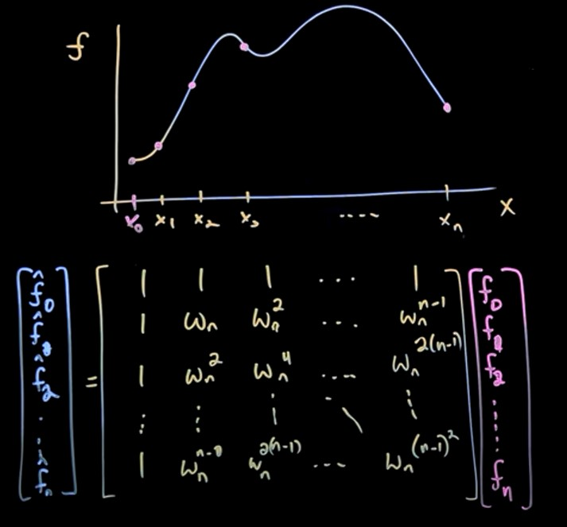
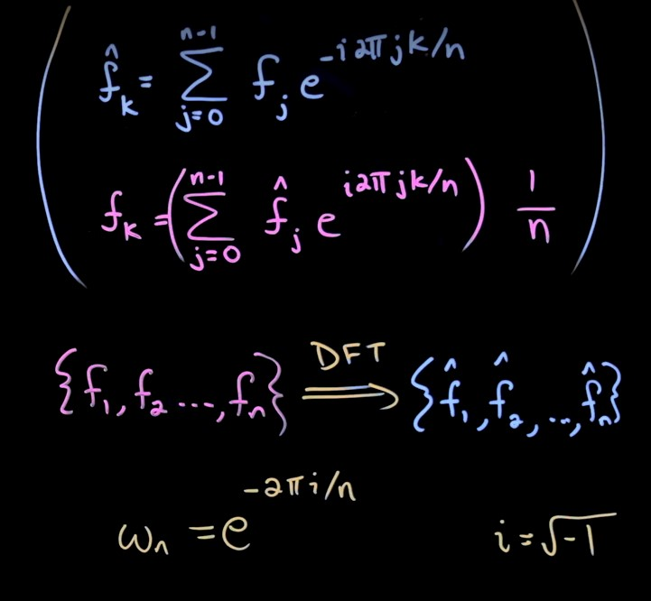
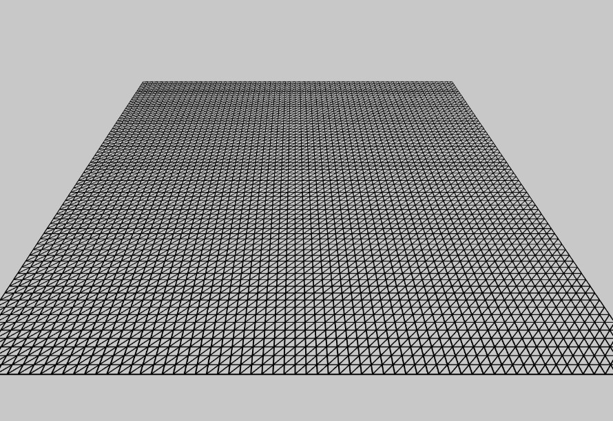
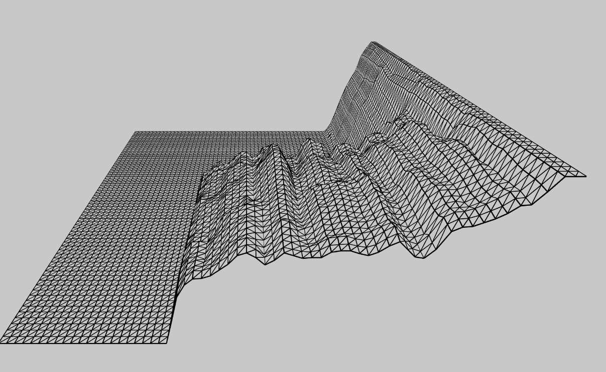

# Final Project: Fast Fourier Transform Map

## Applied in Music Visualization with BAD BUNNY

### Summer 2022

### Linear Algebra

> In this project I will use concepts of linear algebra to compute a fast fourier transform on sound signals from music and visualize it in a 3D map.

## 1. Euler's Formula

Idea: We need a formula to represent the complex numbers in a polar form.

This formula does not only represent complex numbers, but it can also represent polar equations.

## 2. Fourier Series

> "The Fourier series is linear algebra in infinite dimensions. The “vectors” are functions
> f(x); they are projected onto the sines and cosines; that produces the Fourier coefficients
> ak and bk" (Gilbert Strang)

What makes so fantastic about this formula is it's linear capability of adding simple equations to compute complex ones.

In this example you can see 6 euler's formulas adding together to make one complex equation. (Note: It is trying to approximate a binary signal )

## 3. Discrete Fourier Transform

When we try to approximate a function f(x) with fourier series. Most of the times we do not have beautiful functions like f(x) = sin(x). We usually have a function with discrete values like:

| x   | f(x) |
| --- | ---- |
| 0   | 2    |
| 1   | 5    |
| 2   | 8    |
| 3   | 2    |

That is why we need a discrete transformation.

Idea: If we take some discrete values, we can represent them as a combination of frequency components

$ f^* = $
How much of the k frequency is in the dataset

If we add more values we can make a better approximation of the function.

We have a fourier transformation matrix that helps us to compute the $ f^* = $ components.

As you can see, it takes
$ O(n^2) $
to compute them.

## 4. Fast Fourier Transform

We can take the same idea from the fourier matrix and break it into more simpler matrices with fix up factors.

$$
\left(\begin{array}{cc}
F_{64}
\end{array}\right) =
\left(\begin{array}{cc}
I & D\\
I & -D
\end{array}\right)
\left(\begin{array}{cc}
F_{32} & 0\\
0 & F_{32}
\end{array}\right)
\left(\begin{array}{cc}
P
\end{array}\right)
$$

Permutation matrix.

$$
\left(\begin{array}{cc}
P
\end{array}\right) =
\left(\begin{array}{cc}
1 &  &  & &\\
 &  & 1 & &\\
 &  &  & &1\\
 & 1 &  &  &\\
  &  &  & 1 &\\
\end{array}\right)
$$

Diagonal matrix. (Sorts even and odd numbers)

$$
\left(\begin{array}{cc}
D
\end{array}\right) =
\left(\begin{array}{cc}
w^0 &  &  & \\
 & w^1 & & \\
 &  &  .& \\
 &  &  & .\\
  &  &  &  &w^n\\
\end{array}\right)
$$

Now we can represent a fourier matrix with very simple matrices.

## 5. Why is "Fast"?

It takes
$ O(n log_2(n)) $
to compute them.

## 6. My Project

Idea: I want to represent Bad Bunny music signal in time.

### Important tools:

- I will use P5.js as my main framework.
- I will use a $ 2^6 $ matrix to represent the sound signal from music.
- It means, I will have 64 discrete values to approximate the signal
- P5.js framework includes an FFT transformation library that I will use.
- As FFT values are complex numbers. I will take the absolute value to represent them in the map.
- I will create this map with triangles and vertices. Each vertex represent the frequency $ f^* $ in time.

## Interesting Notes

FFT is one of the most important algorithms nowadays for processing signals, music, image compression, and a lot more.

As you can see, when Bad Bunny starts to sing, the background music keeps intact in the higher frequencies. It means we can sort the frequencies we do not want, clear some noises or separate the singer from the background without much loss.

## Author

- [@Joel del Castillo](https://github.com/joeldelcastillo)
